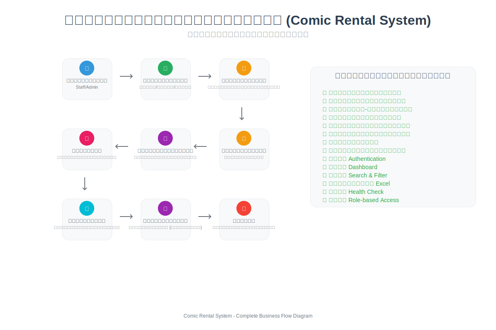

# Comic Rental System

ระบบเช่าหนังสือการ์ตูนที่พัฒนาด้วย ASP.NET Core Web API และ Frontend ด้วย HTML/CSS/JavaScript พร้อม Tauri สำหรับ Desktop Application

## แผนผังการทำงานของระบบ



ระบบจัดการการเช่าหนังสือการ์ตูนครบวงจร ตั้งแต่การเข้าสู่ระบบ จัดการลูกค้า ค้นหาและเลือกหนังสือ สร้างรายการเช่า ชำระเงิน คืนหนังสือ คำนวณค่าปรับ จนถึงการสร้างรายงาน

## เทคโนโลยีที่ใช้

### Backend
- **ASP.NET Core 9.0** - Web API
- **Entity Framework Core** - ORM
- **SQLite** - Database
- **JWT Authentication** - การยืนยันตัวตน
- **BCrypt** - การเข้ารหัสรหัสผ่าน
- **Manual Object Mapping** - การ map object แบบ manual
- **ClosedXML** - Excel export

### Frontend
- **HTML5/CSS3/JavaScript** - Web Frontend
- **Tauri** - Desktop Application (รองรับ Windows, macOS, Linux, Android, iOS)
- **Live Server** - Development server

## ข้อกำหนดของระบบ

### Software ที่ต้องติดตั้ง
- **Node.js** (v18 หรือสูงกว่า)
- **.NET 9.0 SDK**
- **Python 3.x** (สำหรับ seeding database)
- **Git**

### สำหรับ Tauri (Desktop App)
- **Rust** (latest stable)
- **System dependencies** (ตามระบบปฏิบัติการ)

### สำหรับ Android App
- **Android Studio** หรือ **Android SDK**
- **Java Development Kit (JDK)** 11 หรือสูงกว่า
- **Android NDK** (สำหรับ native code)
- **Tauri CLI v2** ที่รองรับ mobile

## การติดตั้ง

### 1. Clone Repository
```bash
git clone <repository-url>
cd rent-app
```

### 2. ติดตั้ง Dependencies

#### Frontend Dependencies
```bash
npm install
```

#### Backend Dependencies
```bash
cd ComicRental
dotnet restore
```

### 3. ตั้งค่า Database

#### สร้าง Database และ Migration
```bash
cd ComicRental
dotnet ef database update
```

#### เพิ่มข้อมูลตัวอย่าง (Optional)
```bash
cd ..
python3 seed_database.py
```

### 4. ตั้งค่า Configuration

#### Backend Configuration
แก้ไขไฟล์ `ComicRental/appsettings.json`:
```json
{
  "ConnectionStrings": {
    "DefaultConnection": "Data Source=comic_rental.db"
  },
  "Jwt": {
    "Key": "your-secret-key-here",
    "Issuer": "ComicRental",
    "Audience": "ComicRental"
  }
}
```

## การรัน Application

### Development Mode

#### 1. รัน Backend API (Terminal 1)
```bash
npm run api
# หรือ
cd ComicRental && dotnet run
```
API จะทำงานที่: `http://localhost:5081`

#### 2. รัน Frontend 

**สำหรับ Web Browser (Terminal 2):**
```bash
npm run dev
```
Frontend จะทำงานที่: `http://localhost:3000`

**สำหรับ Desktop App (Terminal 3):**
```bash
# ต้องรัน npm run dev ก่อน!
npm run tauri dev
```

**สำหรับ Android App:**
```bash
# ต้องรัน npm run dev ก่อน!
npm run tauri android init
npm run tauri android dev
```

#### ลำดับการรัน Development แบบเต็ม:

**สำหรับ Desktop App:**
1. **Terminal 1**: `npm run api` (Backend API)
2. **Terminal 2**: `npm run dev` (Frontend Web Server) 
3. **Terminal 3**: `npm run tauri dev` (Desktop App)

**สำหรับ Android App:**
1. **Terminal 1**: `npm run api` (Backend API)
2. **Terminal 2**: `npm run dev` (Frontend Web Server)
3. **Terminal 3**: `npm run tauri android dev` (Android App)

หมายเหตุ: Tauri จะเชื่อมต่อไปที่ `http://localhost:3000` ดังนั้นต้องรัน `npm run dev` ก่อนเสมอ

### Production Mode

#### Build Backend
```bash
cd ComicRental
dotnet publish -c Release -o publish
```

#### Build Frontend
Frontend ไม่ต้อง build เพิ่มเติม ใช้ไฟล์ HTML/CSS/JS ตรงๆ

#### Build Android App
```bash
# Build สำหรับ Android
npm run tauri android build

# Build และ sign สำหรับ release
npm run tauri android build --target aarch64-linux-android --release
```

### การติดตั้งและตั้งค่าสำหรับ Android

#### 1. ติดตั้ง Android dependencies
```bash
# ติดตั้ง Android targets สำหรับ Rust
rustup target add aarch64-linux-android armv7-linux-androideabi i686-linux-android x86_64-linux-android

# เริ่มต้นโปรเจค Android
npm run tauri android init
```

#### 2. การตั้งค่า Android
- ตั้งค่า `ANDROID_HOME` environment variable
- ตั้งค่า `JAVA_HOME` environment variable
- เพิ่ม Android SDK tools ใน PATH

#### 3. การทดสอบบน Android
```bash
# รันบน emulator
npm run tauri android dev

# รันบน device จริง (เปิด USB debugging)
npm run tauri android dev --device
```

## โครงสร้างโปรเจค

```
rent-app/
├── ComicRental/           # Backend ASP.NET Core
│   ├── Controllers/       # API Controllers
│   ├── Models/           # Data Models & DTOs
│   ├── Data/             # Database Context
│   ├── Migrations/       # EF Migrations
│   └── wwwroot/         # Static files
├── admin/               # Admin Interface
├── staff/               # Staff Interface
├── js/                  # Frontend JavaScript
├── src-tauri/           # Tauri Desktop App
├── HashGenerator/       # Password hash utility
├── PasswordFix/         # Password fix utility
└── UpdateDB/           # Database update utility

```

## การใช้งาน

### ผู้ใช้ระบบ
1. **Admin** - จัดการระบบทั้งหมด
2. **Staff** - จัดการการเช่าและลูกค้า
3. **Customer** - ค้นหาและเช่าหนังสือ

### หน้าจอหลัก
- **Dashboard** - ภาพรวมของระบบ
- **Books Management** - จัดการหนังสือ
- **Customers Management** - จัดการลูกค้า
- **Rentals Management** - จัดการการเช่า
- **Reports** - รายงานต่างๆ
- **Settings** - ตั้งค่าระบบ

## API Documentation

เมื่อรัน Backend แล้ว สามารถเข้าถึง Swagger UI ได้ที่:
```
http://localhost:5081/swagger
```

## Database Schema

### หลักๆ Tables
- **Books** - ข้อมูลหนังสือ
- **Customers** - ข้อมูลลูกค้า
- **Employees** - ข้อมูลพนักงาน
- **Rentals** - ข้อมูลการเช่า
- **Categories** - หมวดหมู่หนังสือ
- **Fines** - ค่าปรับ
- **Settings** - ตั้งค่าระบบ

## Utilities

### Password Management
```bash
# Generate password hash
cd HashGenerator && dotnet run

# Fix passwords in database
cd PasswordFix && dotnet run
```

### Database Management
```bash
# Update database schema
cd UpdateDB && dotnet run
```

## การแก้ไขปัญหา

### ปัญหาที่พบบ่อย
1. **Database locked** - ปิด connection ที่ค้างอยู่
2. **CORS Error** - ตรวจสอบการตั้งค่า CORS ใน backend
3. **JWT Token expired** - ล็อคอินใหม่

### Logs
- Backend logs: Console output
- Frontend logs: Browser Developer Tools

## การมีส่วนร่วมในการพัฒนา

1. Fork repository
2. สร้าง feature branch
3. Commit changes
4. Push to branch
5. Create Pull Request

## License

This project is licensed under the MIT License.

## ผู้พัฒนา

- Backend: ASP.NET Core Web API
- Frontend: HTML/CSS/JavaScript
- Desktop: Tauri Framework